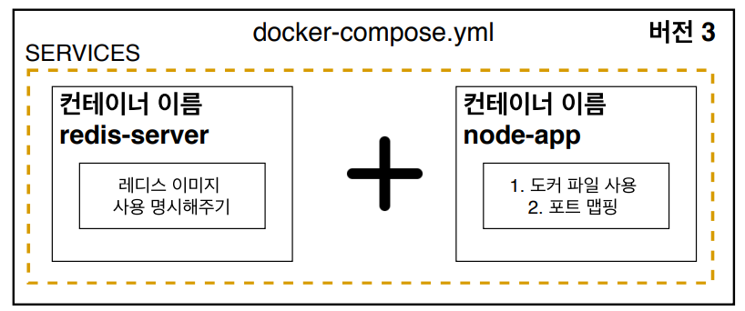

## # 구조



---

<br>

## # docker-compose 사용이유

멀티 컨테이너 상황에서 쉽게 네트워크를 연결시켜주기 위해서 `Docker Compose`를 이용하면 된다.

---

<br>

## # 도커 환경에서 레디스 클라이언트 생성시 주의사항

보통 도커를 사용하지 않는 환경에서는 Redis 서버가 작동되고 있는 곳의 host 옵션을
URL로 주면 되지만, docker-compose를 사용할 때는 host 옵션을
docker-compose.yml 파일에 명시한 컨테이너 이름으로 주면된다.

```js
const redisClient = redis.createClient({
  // host: "127.0.0.1,
  // host: "https://redis-server.com,
  host: "redis-server",
  port: 6379,
});
```
